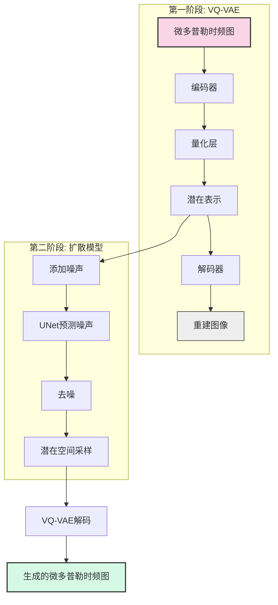
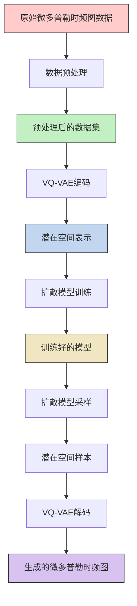

## Training an unconditional latent diffusion model

Creating a training image set is [described in a different document](https://huggingface.co/docs/datasets/image_process#image-datasets).

### Cloning to local
```bash
git clone https://github.com/zyinghua/uncond-image-generation-ldm.git
```

Then call:
```bash
cd uncond-image-generation-ldm
```

### Installing the dependencies

Before running the scripts, make sure to install the library's training dependencies:
```bash
pip install -r requirements.txt
```

And initialize an [🤗Accelerate](https://github.com/huggingface/accelerate/) environment with:

```bash
accelerate config
```

### Change Pretrained VAE settings
You can specify which pretrained VAE model to use by changing the `VAE_PRETRAINED_PATH` and `VAE_KWARGS` variables in `train.py`, at the top.

### Unconditional Flowers

An examplar command to train a DDPM UNet model on the Oxford Flowers dataset, without using GPUs:

```bash
accelerate launch train.py \
  --dataset_name="huggan/flowers-102-categories" \
  --resolution=256 \
  --output_dir="ddpm-ema-flowers-256" \
  --train_batch_size=16 \
  --num_epochs=150 \
  --gradient_accumulation_steps=1 \
  --use_ema \
  --learning_rate=1e-4 \
  --lr_warmup_steps=500 \
  --mixed_precision=no \
```

### Training with multiple GPUs

`accelerate` allows for seamless multi-GPU training. After setting up with `accelerate config`,
simply add `--multi_gpu` in the command. For more information, follow the instructions [here](https://huggingface.co/docs/accelerate/basic_tutorials/launch)
for running distributed training with `accelerate`. Here is an example command:

```bash
accelerate launch --multi_gpu train.py \
  --dataset_name="huggan/flowers-102-categories" \
  --resolution=256 \
  --output_dir="ddpm-ema-flowers-256" \
  --train_batch_size=16 \
  --num_epochs=150 \
  --gradient_accumulation_steps=1 \
  --use_ema \
  --learning_rate=1e-4 \
  --lr_warmup_steps=500 \
  --mixed_precision=no \
```

To be able to use Weights and Biases (`wandb`) as a logger you need to install the library: `pip install wandb`.

### Using your own data

To use your own dataset, there are 3 ways:
- you can either provide your own folder as `--train_data_dir`
- or you can provide your own .zip file containing the data as `--train_data_files`
- or you can upload your dataset to the hub (possibly as a private repo, if you prefer so), and simply pass the `--dataset_name` argument.

Below, we explain both in more detail.

#### Provide the dataset as a folder/zip file

If you provide your own folders with images, the script expects the following directory structure:

```bash
data_dir/xxx.png
data_dir/xxy.png
data_dir/[...]/xxz.png
```

In other words, the script will take care of gathering all images inside the folder. You can then run the script like this:

```bash
accelerate launch train.py \
    --train_data_dir <path-to-train-directory> \
    <other-arguments>
```

Or (if it is a zip file):
```bash
accelerate launch train.py \
    --train_data_files <path-to-train-zip-file> \
    <other-arguments>
```

Internally, the script will use the [`ImageFolder`](https://huggingface.co/docs/datasets/v2.0.0/en/image_process#imagefolder) feature which will automatically turn the folders into 🤗 Dataset objects.

Official [diffusers](https://github.com/huggingface/diffusers) repo also has a pipeline for uncond ldm that can be found [here](https://github.com/huggingface/diffusers/tree/main/src/diffusers/pipelines/deprecated/latent_diffusion_uncond).

# 微多普勒时频图数据增广 (Micro-Doppler Spectrogram Data Augmentation)

本项目基于潜在扩散模型(Latent Diffusion Model)实现微多普勒时频图像的数据增广，解决步态微多普勒时频图数据量不足的问题。

## 项目概述

微多普勒时频图是雷达信号处理中的重要数据形式，特别是在步态识别等应用中。然而，由于采集成本高、样本数量有限等原因，数据量不足成为制约相关研究的瓶颈。本项目使用两阶段生成模型进行数据增广：
1. 第一阶段：VQ-VAE (Vector Quantized Variational Autoencoder) 将高维图像压缩到潜在空间
2. 第二阶段：在潜在空间中使用条件扩散模型生成新样本

## 模型架构

下图展示了微多普勒时频图数据增广的整体架构：



该架构首先使用VQ-VAE将微多普勒时频图压缩到潜在空间，然后在潜在空间中应用扩散模型进行采样，最后通过VQ-VAE的解码器生成新的微多普勒时频图样本。

## 处理流程

整个数据增广的处理流程如下：



## 特点

- 支持256x256彩色微多普勒时频图像生成
- 两阶段生成架构，保证生成质量和多样性
- 支持批量生成和自定义推理参数
- 适用于步态微多普勒时频图数据增广

## 安装依赖

```bash
pip install -r requirements.txt
```

## 数据准备

1. 将您的微多普勒时频图数据集组织为以下结构：

```
data_dir/
  ├── user_001/
  │   ├── image_001.png
  │   ├── image_002.png
  │   └── ...
  ├── user_002/
  │   ├── image_001.png
  │   └── ...
  └── ...
```

2. 运行数据预处理脚本（确保图像尺寸为256x256）：

```bash
accelerate launch train.py \
  --train_data_dir path/to/your/data_dir \
  --resolution 256 \
  --output_dir microdoppler_ldm_model \
  --train_batch_size 16 \
  --num_epochs 150 \
  --use_ema \
  --learning_rate 1e-4 \
  --lr_warmup_steps 500
```

## 数据预处理

微多普勒时频图数据预处理是整个流程中的重要一步，确保输入数据的一致性和质量。预处理步骤包括：

1. **数据格式统一**：将所有图像转换为RGB格式，确保通道数一致
2. **尺寸调整**：将所有图像调整为256x256像素，便于模型处理
3. **数据归一化**：将像素值归一化到[-1, 1]范围，提高训练稳定性
4. **目录结构整理**：保持用户目录结构，便于后续分析

### 预处理命令

可以使用以下命令单独执行数据预处理：

```bash
python train.py \
  --preprocess_only \
  --raw_data_dir path/to/raw/data \
  --processed_data_dir path/to/processed/data \
  --resolution 256 \
  --max_samples 1000  # 可选，限制处理样本数量
```

预处理后的数据将保持原始目录结构，但图像会被标准化为256x256的RGB格式。

### 预处理与训练一体化

也可以在训练时自动执行预处理：

```bash
python train.py \
  --raw_data_dir path/to/raw/data \
  --processed_data_dir path/to/processed/data \
  --resolution 256 \
  --output_dir microdoppler_ldm_model \
  --train_batch_size 16 \
  --num_epochs 150 \
  --use_ema \
  --learning_rate 1e-4 \
  --lr_warmup_steps 500
```

这将首先预处理数据，然后使用处理后的数据进行模型训练。

## 训练模型

1. 训练VQ-VAE模型（如果您想使用自定义的VAE模型）：
   - 修改`train.py`中的`VAE_PRETRAINED_PATH`和`VAE_KWARGS`变量
   - 或者使用默认的预训练VQ-VAE模型

2. 训练扩散模型：

```bash
accelerate launch train.py \
  --train_data_dir path/to/your/data_dir \
  --resolution 256 \
  --output_dir microdoppler_ldm_model \
  --train_batch_size 16 \
  --num_epochs 150 \
  --use_ema \
  --learning_rate 1e-4 \
  --lr_warmup_steps 500
```

## 生成微多普勒时频图像

1. 修改`inference.py`中的`model_id`为您的模型路径
2. 运行推理脚本：

```bash
python inference.py
```

3. 生成的图像将保存在`generated_images`目录中

## 自定义生成参数

您可以通过修改`inference.py`中的以下参数来自定义生成过程：

```python
batch_size = 16  # 一次生成的图像数量
num_inference_steps = 1000  # 推理步数
output_dir = "generated_images"  # 输出目录
```

## 引用

如果您在研究中使用了本项目，请引用以下论文：

```
@article{rombach2022highresolution,
  title={High-Resolution Image Synthesis with Latent Diffusion Models},
  author={Rombach, Robin and Blattmann, Andreas and Lorenz, Dominik and Esser, Patrick and Ommer, Björn},
  journal={arXiv preprint arXiv:2112.10752},
  year={2022}
}
```

## 许可证

本项目基于MIT许可证开源。

